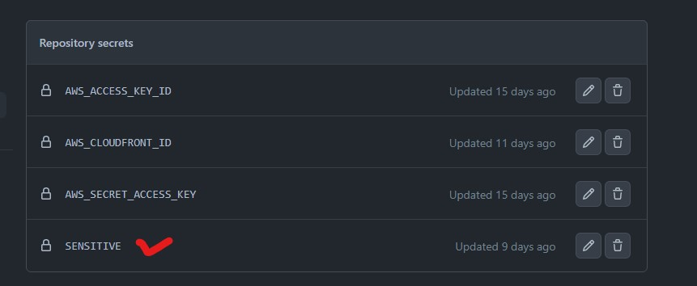
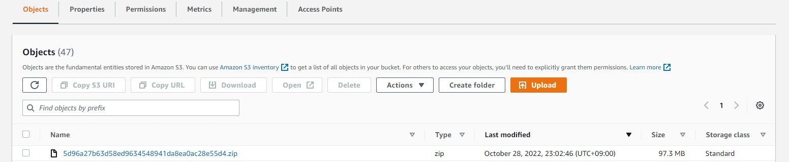
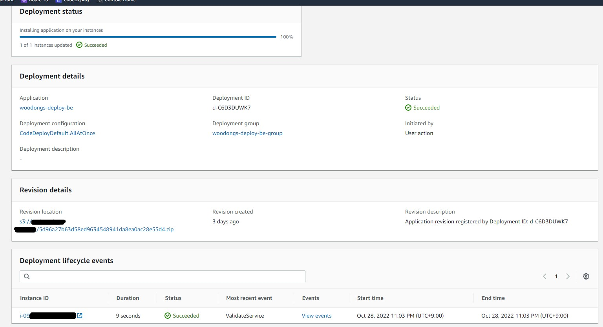
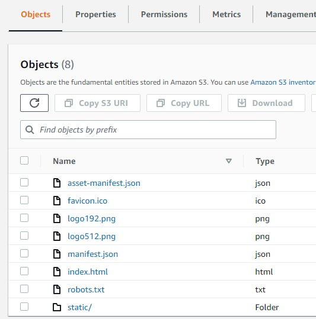

    메인 프로젝트 관련 새로 배운 점 정리

메인 프로젝트 종료일까지 열심히 달린 결과 무사히 프론트와 백쪽 배포를 할 수 있었다. <br>
하지만 메인 프로젝트 회고 글에도 작성했듯이, 아쉬운 점도 상당히 많았다. 4주라는 시간 안에  
여러 기능을 시도해보고 싶은 욕심은 많았지만 실상 나에게 주어진 시간은 그리 많은 편이 아니었다. <br>

프로젝트가 끝나고 부트 캠프마저 끝나자 나는 들판에 풀어놓은 양과 같았고 어디로 가야 할지 무엇을 해야 할지
고민이 되기 시작했다. 취업을 위한 기술 면접 공부와 기본적인 기술들에 대한 추가 공부를 하기 전에 메인 프로젝트에서
아쉬웠던 점을 몇몇 보강해보자 하는 생각이 들었는데 나는 배포 쪽을 주로 맡아서인지 배포에 대해 아쉬움이 많았다.  

특히 도커처럼 Container를 활용해서 배포하는 것과 배포 자동화를 기한 내에 하지 못했었는데 도커는 괜히 건드렸다가
또 안될까 하는 걱정에 다음에 따로 연습을 해보기로 했고 결론적으로 CI/CD를 추가로 도입해보기로 정했다. 

<!-- more -->

---

## GitHub Actions
백엔드의 자동배포는 이전에 "스프링 부트와 AWS로 혼자 구현하는 웹 서비스"라는 책을 통해 시도해 본 적이 있어 
관련 키워드는 알고 있었다.  

책에서는 Jenkins를 사용해서 빌드를 했었는데 유료라서 몇번 정도만 해보고
GitHub Actions으로 넘어갔었다. AWS Pipeline도 부트 캠프를 진행 하면서 한번 사용해본 경험이 있어 나중에 
다른 툴을 사용하게 되더라도 어느정도 이해가 되리라 생각한다.

그리고 구글에 관련 자료도 많아 찾아보면서 하니 그리 어렵게 느껴지지 않았다. <br>
아직 외부 자료를 보지 않고 혼자만의 힘으로 할 실력은 못 되지만 키워드를 알고 어떤 흐름으로 진행된다는 것을<br>
익힐 수 있었던 좋은 경험이었다. 특히 프론트엔드 쪽도 진행해 볼 수 있어서 꽤 재미있었다. <br><br>

-----

### BackEnd(Spring) 


**민감 정보 push?**<br><br>
나는 application-sensitive.yml에 민감 정보들을 넣어놨었는데 이걸 어떻게 푸쉬를 해야 할지 고민했었다. <br>
아니 커밋이 되지 말라고 gitignore에 한건데 푸쉬를 해야 배포가 되니 난감했던 기억이 있다.


``` markdown title=""
Secrets
``` 
<div class="result" markdown>
{: .align-center}
</div>

구글링 하다 보니 참신한 방법을 알았는데 바로 GitHub Secrets을 이용하는 방법이었다. <br>
배포 단계에서 Secret에 넣어놓은 sensitive 내용물을 읽어와서 ec2에 sensitive yml을 새로 만들게 된다.<br>
이것을 GitHub Actions에 쓰일 yml에 작성해놓으면 깃허브가 알아서 해준다.<br>

백엔드 자동 배포의 큰 흐름은 다음과 같다.

**(1) yaml에서 설정한 브랜치로 push나 PR을 날린다**

**(2) GitHub Actions에서 빌드를 하고 zip 형식으로 S3에 업로드**


``` markdown title="zip으로 업로드 하는 이유?"
CodeDeploy가 S3에서 가져올때 zip이나 tar형식으로 가져온다고 한다.
``` 
<div class="result" markdown>

</div>


<br>
**(3) GitHub Actions에서 S3로 업로드를 하면 CodeDeploy에 deploy 요청 보내기**

``` markdown title=""
Deploy
``` 
<div class="result" markdown>

</div>

CodeDeploy Application - Application Group에서 진행 상황을 한눈에 볼 수 있었다.
심지어 실패하면 어떤 부분에서 실패했는지, 원인까지 간략하게 나와 문제를 해결하는데 수월했다. 
다행히 대부분 오타나 경로로 인한 문제였다.

**(4)CodeDeploy가 S3에서 zip을 가져와 unzip 한 뒤에 yml에서 설정한 대로 EC2에 배포** 

이 부분을 위해서 EC2에 Amazon CodeDeploy Agent를 설치해야 한다. <br>
프로젝트 초기에 나는 일반 우분투로 EC2를 구동시켰었는데 Agent를 설치하기 위해서는 Ruby를 먼저 설치해야 한다.


여기서 문제가 발생했다. 대부분의 참고 자료에는 전부 최신 버전 Ruby를 받으라고 되어있었는데 <br>
**Agent는 Ruby2.x에서만 설치가 되고 최신인 Ruby3.x에서는 설치가 안 되는 이슈가 있었다.** <br>

여러 삽질과 [구글링 끝에 GitHub에서 누가 스크립트를 작성해서 올려놨었는데](https://github.com/aws/aws-codedeploy-agent/issues/301) EC2에서 적용하니 설치가 잘 되었다.
나중에 EC2를 Amazon Linux2로 바꾸게 되었지만 공식 문서대로 설치했더니 별문제 없이 잘 진행되었다. <br>

<details markdown="1">
<summary>yml코드 접기/펼치기</summary>

```yaml
name: Woodongs-cdci-test

## setupdone
## test1
on:
  push:
    branches: [ "be-production" ]
  pull_request:
    branches: [ "be-production" ]

env:
  AWS_REGION: ap-northeast-2
  S3_BUCKET_NAME: mainproject-bucket
  CODE_DEPLOY_APPLICATION_NAME: woodongs-deploy-be
  CODE_DEPLOY_DEPLOYMENT_GROUP_NAME: woodongs-deploy-be-group

permissions:
  contents: read

jobs:
  deploy:
    name: Deploy
    runs-on: ubuntu-latest
    environment: production
#    permissions:
#      contents: read
#      packages: write

    steps:
      - name: Checkout
        uses: actions/checkout@v3

      - name: Set up JDK 11
        uses: actions/setup-java@v3
        with:
          java-version: '11'
          distribution: 'temurin'

      - name: make application-sensitive.yml
        run: |
            # create application-sensitive.yml
            cd server/src/main/resources
            # application-sensitive.yml 파일 생성
            touch ./application-sensitive.yml
            # GitHub-Actions 에서 설정한 값을 application-sensitive.yml 파일에 쓰기
            echo "${{ secrets.SENSITIVE }}" >> ./application-sensitive.yml
        shell: bash

      - name: Grant execute permission for gradlew
        run: chmod +x gradlew
        working-directory: ./server

      - name: Build with Gradle
        run: ./gradlew build -x test
        working-directory: ./server

        #uses: gradle/gradle-build-action@67421db6bd0bf253fb4bd25b31ebb98943c375e1
        #with:
        #  arguments: clean build

      # (4) AWS 인증 (IAM 사용자 Access Key, Secret Key 활용)
      - name: Configure AWS credentials
        uses: aws-actions/configure-aws-credentials@v1
        with:
          aws-access-key-id: ${{ secrets.AWS_ACCESS_KEY_ID }}
          aws-secret-access-key: ${{ secrets.AWS_SECRET_ACCESS_KEY }}
          aws-region: ${{ env.AWS_REGION }}

      # (5) 빌드 결과물을 S3 버킷에 업로드
      - name: Upload to AWS S3
        run: |
          aws deploy push \
            --application-name ${{ env.CODE_DEPLOY_APPLICATION_NAME }} \
            --ignore-hidden-files \
            --s3-location s3://$S3_BUCKET_NAME/$GITHUB_SHA.zip \
            --source .
      # (6) S3 버킷에 있는 파일을 대상으로 CodeDeploy 실행
      - name: Deploy to AWS EC2 from S3
        run: |
          aws deploy create-deployment \
            --application-name ${{ env.CODE_DEPLOY_APPLICATION_NAME }} \
            --deployment-config-name CodeDeployDefault.AllAtOnce \
            --deployment-group-name ${{ env.CODE_DEPLOY_DEPLOYMENT_GROUP_NAME }} \
            --s3-location bucket=$S3_BUCKET_NAME,key=$GITHUB_SHA.zip,bundleType=zip
```
</details>

-----

### FrontEnd(React)

백엔드 배포보다 한 단계 간소화된 느낌이었다. 

다만 CloudFront에서 invalidation을 하는 부분만 주의해 주면 될 듯싶었다. 

프로젝트 배포하기 포스팅에서 적어놨지만 S3를 업데이트하고 CloudFront에서 변경 사항 저장을 해도 바로 업데이트가 되지 않는데 이는 **CloudFront에서 캐시에** 
**파일을 24시간 동안 저장**하기 때문이다.  

이를 해소하기 위해 invalidation(무효화)항목에서 최신 업데이트가 필요한 경로를 설정해야 한다. <br>
나는 그냥 전체 파일을 업데이트하기 위해(/*)로 설정해두었다. <br>

프론트엔드(React) 자동 배포의 큰 흐름은 다음과 같다.

**(1) yaml에서 설정한 브랜치로 push나 PR을 날린다** 

**(2) GitHub Actions에서 빌드를 하고 해당 빌드물을 S3에 업로드** 

!!! info
    React빌드 폴더 안의 내용물을 그대로 넣는다고 보면 된다. 디렉토리도 똑같이 반영한다.
    ``` markdown title=""
    S3 bucket
    ``` 
    <div class="result" markdown>
    
    </div>
    


<br>

**3. CloudFront에 전체경로(/*)로 invalidation 요청**

<details markdown="1">
<summary>yml 코드 접기/펼치기</summary>

```yaml
name: Woodongs React Build

on: 
  push:
    branches:
      - fe-production #fe-production으로 푸쉬가 일어나면 github actions 실행 트리거 

jobs:
  react: 
    name: Woodongs React Build
    runs-on: ubuntu-20.04
    defaults:
      run:
        working-directory: ./client #빌드할 폴더 
    steps: 
      - name: checkout Github Action
        uses: actions/checkout@v3 
      - uses: actions/setup-node@v3
        with:
          node-version: 14
      
      - name: install npm dependencies #npm 의존성 설치
        run: npm install

      - name: install react-redux #react-redux 설치
        run: npm install react-redux

      - name: React build
        run: npm run build

#빌드시
#Treating warnings as errors because process.env.CI = true.
#Most CI servers set it automatically.
#라는 에러가 나서 package.json - scripts - "build": "CI=false && react-scripts build" 여기에 CI=false 추가 
      
      - name: Configure AWS credentials 
        uses: aws-actions/configure-aws-credentials@v1 
        with: 
          aws-access-key-id: ${{ secrets.AWS_ACCESS_KEY_ID }} #aws IAM user의 accessID, Key를 넣습니다. 
          aws-secret-access-key: ${{ secrets.AWS_SECRET_ACCESS_KEY }} #보안상 github의 secret에 정보를 넣고 거기서 가져옴
          aws-region: ap-northeast-2

     
      - name: Upload to S3
        env:
          BUCKET_NAME: mainproject-deploy #버킷 이름 
        run: |
          aws s3 sync \
            ./build s3://$BUCKET_NAME
      
#CloudFront 배포하면 Invalidation을 해야 갱신이 됩니다. 
#24시간 동안 이전 캐시가 남아있어 저걸 안하면 아무 변화가 안보입니다.     
      - name: CloudFront Invalidation
        env:
          CLOUD_FRONT_ID: ${{ secrets.AWS_CLOUDFRONT_ID }} #cloudfront ID 
        run: |
          aws cloudfront create-invalidation \
            --distribution-id $CLOUD_FRONT_ID --paths /*
```
</details>