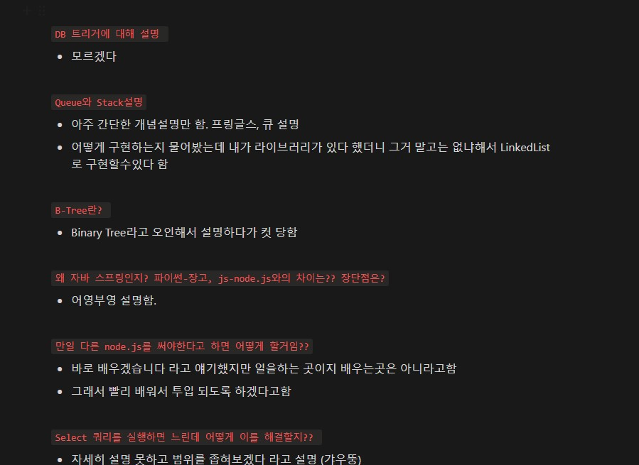

I can say that year 2022 was one of the biggest challenges in my life.  
Graduated from hospitality school in New Zealand, and got a job at a 5-star hotel. I think it was a good start to my career
in the hospitality field. Because of that, It's really a hard decision that give up the whole career I've built and my bachelor's degree.

<!-- more -->

During a lockdown period in 2021, It's good to have enough time to check my interest in learning programming
language by learning some codes from YouTube as many people told me understanding my aptitude for programming
is a key aspect before entering this field. Luckily I found some good fun there.

Since I decided "ok, I wanna be a programmer", my actions were straightforward. I came back to Korea, enrolled
Java/Spring Bootcamp did two team projects and successfully finished the course. It was a pretty tough time as everything
was extremely fast, and difficult to understand. During a zoom session, especially about spring, and spring security, every time
when the tutor explained something, I mumbled to my monitor "I have no idea what you are saying".

However, after two team projects and in terms of related knowledge, I feel I know much better than before for sure.
Also, a Good thing that I experienced was every time when I did something, I felt I was getting used to this.

The big improvement is that now I can see what to study to be a backend developer, but it's just too many things to study.

## Applying for Jobs
After the end of the course, I have begun to apply for various junior backend positions that mainly use Java,
Spring Boot, JPA, and some AWS features. Think I sent around 30 resumes, and I've done only 2 interviews so far.
I asked for some feedback from various channels and I found one big issue. From an interviewer's point of view, my CV
was not that attractive to have a look at in terms of the length of my intro, too much minimized project info, etc.

I guess it took around a month to keep changing it until I made a final version which I felt confidence with it.

## Determining my weaknesses
So far, I did only 2 interviews and 1 test(I failed this). Especially the interview, so many people mentioned
"it really does not matter if you passed or not, it's just a valuable experience" and I totally agree with that.

### First Interview (Failed)
The first company was a massively growing up start-up business with applying IT technologies to the hospitality sector.
(such as contactless check-in/out, remote room service, automated payment, and requesting room turnover remotely) As I
have a hospitality background I thought it would be a great opportunity to be with them, and luckily they offered the interview first.   
However, regretfully, I thought the interview would go easy, and it was a very very big mistake. I was really nervous from the beginning of the interview, and the question was really hard.
The thing is, I felt the questions were hard and that came from my lack of knowledge. No excuses.
I answered all hotel-related questions but answered 40% of tech-skill questions.
And they looked at me like "What the hell is this guy?" when every time I answered the question, and that made me more nervous.   
In general, I did not get a good impression from the interview process, but really ashamed that showing my lack of knowledge in front of others.
One thing I felt pretty odd is that they asked me to do an interview, however, the interviewers seemed they did not know what was going on.

Interview questions I did not answer properly:
1. Explain what is Database Trigger?
2. Explain B-Tree
3. Why did you use Java/Spring? any differences between Python/Django, and JS/Node.js?
4. What will you do when you use Select query, and it's too slow?
5. What is your major weakness in terms of this position?
6. Tell us anything about our company
7. What is Queue & Stack? Which collection will you use and why?

### Second Interview (Failed)
The second company is also a small business in the marketing field, and they are making a new business platform.
From the bad experience of the first interview, this time I spent more time preparing for this interview in terms of skills.
This time I felt much better than the first one as I did not that nervous, answered more questions, and felt more confident.
The interview question was 50:50 general question and tech skill questions. Of course some questions I could not answer but at least
even I did not know the answer, trying to be confident. Unfortunately, could not get a job.

Interview questions I did not answer properly:

1. Seemed you used reverse proxy. Can you tell us what is proxy and the differences between forward proxy and reverse proxy?
2. Imagine that you search for a website(ex: Naver). Tell us the whole flow of this behaviour.
3. Explain to us what is MVC?
4. What is Cache Memory?
5. I saw you used Spring Data JPA. Tell us about the N+1 problem and how would you solve this.
6. Level of confidence in using AWS? such as EC2 configuration

## Maybe I am not ready yet
So far I only did two interviews and realised my basic skills are not ready. However, I found that this is the reason why people said
just take interviews. After each of the interview, I did a little recap and this actually helps a lot by showing parts that I could not answer,
common questions, etc.

{: .align-center}

I believe the key reason of why my basic is not enough is that the way I studied was if I got stuck, find the error, search on Google and fix it, which everyone can do it. 
The problem was I did not approach more deeply to solve the problem.
When I found the error, I could fix it anyway but hardly made that knowledge as mine. (but blogging was quite helpful)

I think now is a good time to build up basic knowledge as there are not many job hiring until next March.
Critical fields that need to be covered will be:   

1. **Java basic(OOP & SOLID)**  
2. **Spring Framework** 
3. **Algorithm/Data structure** 
4. **JPA & SQL** 
5. **Computer Science** 
6. **Personal Projects**  

Of course, it's not possible to understand all the above, however, at least I can find out which part is my utmost weakness
and prioritise it. ~~(all of them)~~ As I said my basic skills are not ready, have to cover them all to be a proper
backend developer. This means I have no choice and need to make a proper strategy to improve.

Simple is the best, I am going to make a daily routine and study a small part of each. If the routine continues, it will be
a proper system of mine. I am hoping that I can do this not like before. It was always difficult to do something routine
but, have to do this anyway aye?

I just got Covid-19 today and forced me to get rest at home. Positively, I think this is a good signal that I can refuel and
freshly start by following my system. Good experience of failing before the end of 2022. 
Can't wait to see this post in the future as a junior backend developer someday.

 

 

