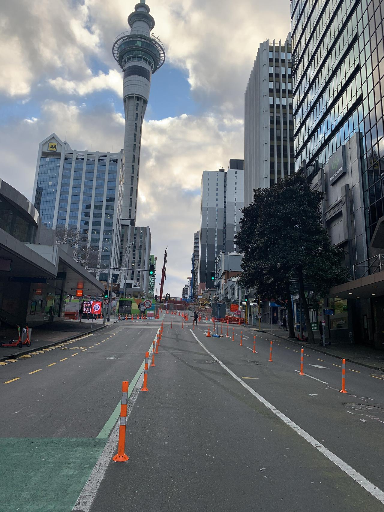

2022년 3월 10일, 2014년부터 이어져 왔던 뉴질랜드와의 인연은 순조롭게 마무리되었다. 그동안의 기억들을 돌아볼 겸, 블로그 글도 조금씩 써볼 겸 정리해보려고 한다. _글 솜씨는 최악이지만..._ 

<!-- more -->

14년 2월 New Plymouth라는 작은 시골마을에 있는 호텔경영학교에 입학해서 15년 2월까지 1년 공부 + 1년 인턴 후 한국으로 잠깐 와 인천의 모 부대에서 군 복무를 한 후에 18년 다시 복학을 해 19년 졸업 후 오클랜드의 Park Hyatt Auckland 호텔 컨시어지 팀에서 약 3년 정도를 일했었다. 호텔 쪽으로 진로를 위해 관련 학교를 갔고 취직까지 매우 순조로웠다. 무려 첫 면접에 바로 합격했으니.. 

하지만 코로나가 결국 뉴질랜드에도 찾아왔고 몇번의 락다운 (한국과는 다르게 필수시설 제외 모든 비즈니스들이 닫았다.. 20년에 한 번, 21년에 길게 한번)으로 정부 보조금을 받으며 집에서 쉰 기간이 있었다. 태생 집돌이인 나에게 있어서는 처음 1~2달 정도는 꽤나 좋았다. 장만 봐오고 술 마시면서 게임하고, 푹 자고.. 자취를 하니 뭐라 하는 사람도 없어서 완전 내 세상이었다. 

{ width="480" height="640" style="display: block; margin: 0 auto" }

당시 뉴질랜드에서는 코로나 통제 시스템으로 Alert level 1~4를 만들었는데 Lv4는 말 그대로 총 봉쇄였고 Lv3는 그보다 살짝 완화된 조치였다. 나는 호텔에서 일하니 결론적으로 Lv2가 되어야 일을 나갈 수 있었다. _(내가 소속된 컨시어지 팀은 필수 인력에 포함이 안되었다. 리셉션들만 제한적으로 나와 근무했음. 하긴 하루에 1명 체크인했으니 사람이 필요 없었다)_ 

그렇게 장장 21년 8월부터 12월까지 약 5개월을 놀았는데 한 10월 말부터 문득 미래에 대해 생각해 보게 되었다. 

내 취업비자는 22년 7월 만기였고 코로나로 인한 특별 영주권도 신청 조건이 되었으나, 이젠 나도 30대를 바라보고 부모님의 나이도 늘어나니 적어도 같은 나라에는 있고 싶었다. 부모님도 타지에 아들 혼자 덜렁 있고 코로나까지 터져있으니 걱정을 많이 하고 있었던 상황이라 한국에 돌아가겠다 라는 결론이 났고, 그 준비는 생각보다 빠르게 이루어졌다.

{ width="480" height="640" style="display: block; margin: 0 auto" }

3월 한국으로 가는것이 정해지고, 12월 일 복귀하기 전까지 이런저런 준비를 했다. 집주인과의 조기 계약 해지, 공과금 해약, 비행기 티켓 등.. 시간적 여유가 많았으니 매우 수월하게 진행되었다.

문제는 한국을 나만 혼자 가는 것이 아닌 내가 키우던 고양이도 같이 데려갈 예정이었기 때문에 추가적으로 알아봐야 할 것들이 생각보다 매우 많았다.

{ width="480" height="640" style="display: block; margin: 0 auto" }

먼저 가장 했던것은 Pet Exporter를 알아보는 것이었다. 그중에서 집에서 가장 가까웠고 가격마저 합리적 이었던 AeroPets라는 곳에서 진행하기로 했다. 반려동물 출국에 관련 모든 걸 대행해주는 업체였는데, 나는 항공편은 개인적으로 하기로 하고 서류대행 만 부탁했다. _(항공편 대행까지 하면 100만원 넘게 추가금액이 들었다)_

서류 작업은 이론상 스스로도 준비해서 할 수 있었으나 고양이와 같이 비행하는 것은 처음이기 때문에 돈을 더 내더라고 확실하고 안전하게 하고 싶었다. 사실 애초에 개인이 하기에는 절차가 꽤나 복잡하고 국제공항 옆에 있는 MPI를 수차례 왔다 갔다 하면서 시간소비를 해야 하니 차도 없는 나에게는 애초에 없는 선택지였다.

그리고 고양이 항공권도 예약하고, 동물병원 검사도 예약하고, 한국에서 필요한 용품들을 구매하는데 생각보다 돈이 너무 많이 깨져서 부담은 되었지만 짤짤이 주식에 투자해서 모은 것과 12월부터 2월까지 일하고 또 남은 연차를 돈으로 추가적으로 받아 가족에게 손을 벌려야 하는 부분은 없어서 다행이었다. 

_내 비행기 티켓은 130만원 정도였지만 먼지를 위한 비용으로 약 250만 원 정도 들어갔다..._

그렇게 12월이 되고 뉴질랜드는 백신 맞은 사람들은 제한이 완화되는 Traffic Light System으로 전환하면서 나는 다시 호텔로 복귀하게 된다.  당시 필수 근로자들은 2차 백신 접종을 안 하면 강제 해고당하고, 저 신호등 체계도 백신 미접종자 들은 차별 한다며 말이 매우 많았다. 근데 나는 그냥 3차까지 다 맞았다.