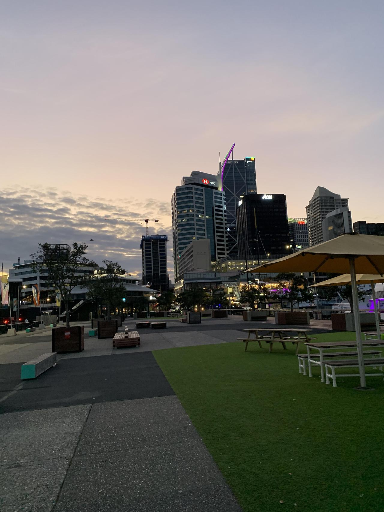
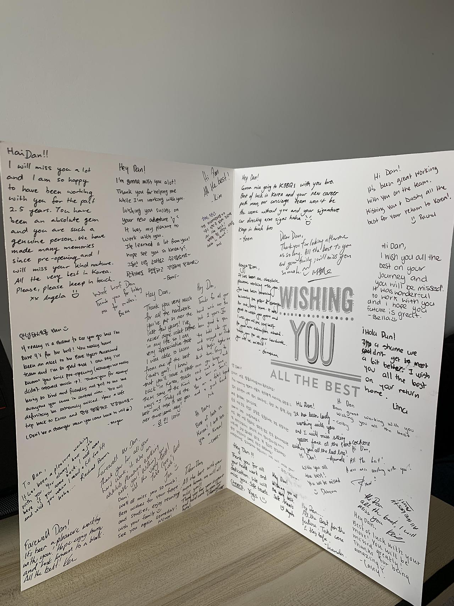
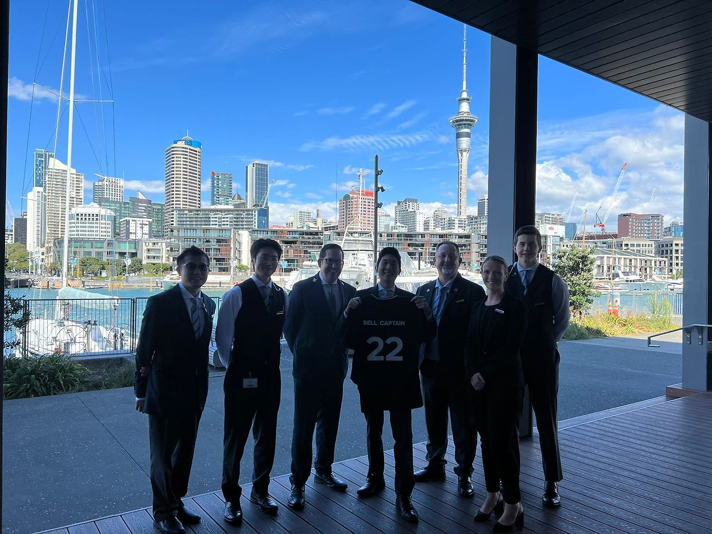

문득 정신 차리니 어느덧 마지막 출근날 아침이다.

<!-- more -->

{ width="480" height="640" style="display: block; margin: 0 auto" }

 인생에서 처음으로 졸업 후 좋은 직장에서 일해서 그랬던 것일까, 전날부터 전역할 때처럼 기분이 엄청 이상했다. 원래 퇴사 날까지 쭉 연차를 썼어도 되었지만 마지막 금, 토, 일요일은 바쁘기도 하고 마지막 날까지 최선을 다하고 싶어 일하기로 했다. 일요일은 보통 체크인은 별로 없고 대부분 체크아웃이라 오후 1시쯤 되면 많이 조용해진다. 마지막을 장식하기에 안성맞춤이라고 생각했다. 지금 생각해도 그때 일한 게 정말 잘했던 것 같다. 엄청 바쁜 주말이었지만 후회가 하나도 남지 않고 좋게 매듭 진 느낌이다. 

{ width="480" height="640" style="display: block; margin: 0 auto" }

2019년부터 22년까지, 첫 직장이라 힘든일도 엄청 많았지만 막상 돌이켜 보면 좋은 사람들과 좋은 기억들이 99%라서 나름 열심히 살았다 라는 것에 대한 답변을 받은 것 같다. 

{ width="480" height="640" style="display: block; margin: 0 auto" }

다들 잘 지내길!