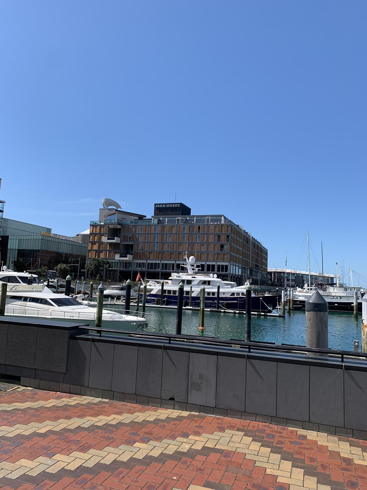
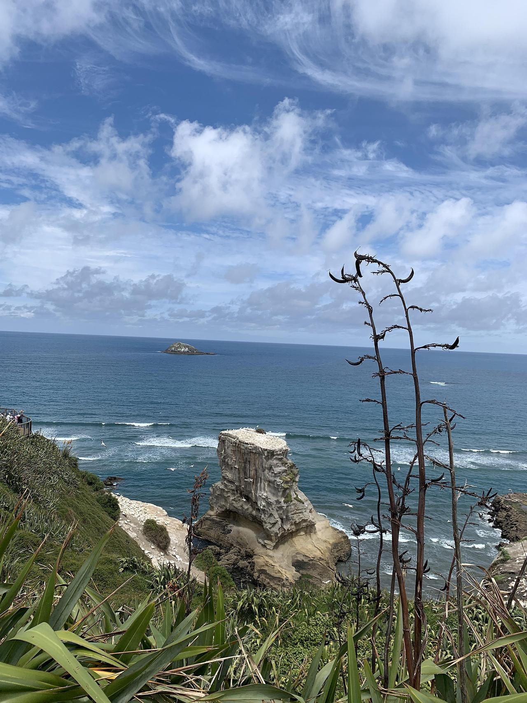

22년 2월 퇴사하기 전까지 그렇게 바쁘지는 않을 것이라 생각했었는데 나의 큰 오산이었다.

사람들이 그동안 어딜 나가서 돌아다니질 못했던 그런 욕망들이 터져서였을까, 매주 금요일, 토요일, 일요일 아침은 매우 매우 바빴다. 더 군다가 이런저런 제약이 풀려서인지 호텔 직원들 중에서 점점 밀첩 접촉으로 인한 격리자들이 조금씩 나오기 시작했다. 이게 큰 스노우볼이 되었는데, 특히 프론트 팀은 당시에 인원 충원이 덜 되어있던 상태여서 누가 격리를 하면 다른 누군가가 초과 근무를 해서 커버를 쳐야 하는 상황까지 갔었다. 문제는 그렇게 커버를 쳐준 직원이 결국은 몸져누워서 또 다른 누군가가 그 몸져누운 직원을 또 커버 쳐줘야 하고 그런 악순환이 반복되었고 그 사이사이 격리자가 나오고 그러니 미칠 노릇이었다. 

<!-- more -->

내가 속했던 컨시어지 팀은 크게보면 프론트 오피스 팀에 소속되어 있으나 약간 별개의 부서였다. 그리고 Staff수도 여유 있었어서 리셉션 팀처럼 큰 문제는 없었다. 내 직책은 벨 캡틴이었는데 포터 친구들을 적새적소에 배치해서 발레파킹, 짐 배달, 고객 응대, 기타 잡무 등을 원활하게 하고 8시간 근무시 30분x1, 10분x2 의 휴식 여건을 상황에 맞춰 보장해 주어야 했다 거기에 나는 호텔 오픈전에 입사했고 _(처음엔 컨시어지 팀에 나와 Cheif Concierge 둘 뿐이었다)_ 컨시어지 업무를 치프와 같이 만들어 왔었기에 레스토랑, 투어, 리무진, 티켓 예약 과 이런저런 기타 컨시어지 업무도 같이 했다. 

하지만 이쪽도 나름 고충이 있었는데 호텔 사이즈에 주차공간이 너무 적어서 다른 주차타워를 이용해야 했다. 한번 주차하고 오면 꽤나 시간이 소요되었으며 그 와중에 손님 짐까지 관리를 해야해서 바쁜 날엔 긴 딜레이가 발생할 때가 많았다. 왜 나는 1명만 존재하는 걸까 하게 느끼게 되는 순간들이 참 많았다. 그래도 팀워크 만큼은 너무 좋았다.

{ width="480" height="640" style="display: block; margin: 0 auto" }

그렇게 2월정도 되자 바쁜 건 많이 줄어서 퇴사 전 7일 정도 휴가를 썼다. 마무리 준비도 하고 로드 트립을 다녀 올 생각이었는데 휴가 1일 차 아침부터 편도가 붓고 열도 나고 해서 코로나 PCR 테스트를 받았다. 당시에 뉴질랜드는 자가진단키트 배포 전이었고 확진자 수가 폭증하고 있을 때라 간호사가 결과까지 5일 정도 걸린다고 했다.

하지만 5일이 넘어도 결과가 나오지 않자 다시 전화를 했는데 그날부터 정부 차원으로 RAT(신속항원검사키트) 가 배포되어 지금 병원으로 오면 바로 해주겠다고 해서 테스트하고 음성까지 확인하고 집에 왔다. 이렇게 전화 후 결과까지의 걸린 시간은 약 40분, 아직 첫날 코쑤신 PCR의 결과는 나오지 않았다. 

남은 시간동안은 한국 갈 준비를 해야 해서 어디 멀리 여행 갈 시간은 부족했기에 당일치기로 1시간 거리에 있는 Muriwai Beach에 다녀왔다. 개인적으로 새를 좋아하는데 새들이 참 많았다. 이곳의 큰 특징으로는 Gannet (부비새?) 이라는 새들이 절벽에서 무리지어 사는 Gannet Colony 라는 점이다. 개인적으로 남극다큐에서 펭귄들이 무리지어 사는게 생각났다. 근처에 가니 강렬하고 비릿한 냄새가 났지만 풍경 하나만큼은 장관이었다. 서핑으로도 유명한 지역이다.

{ width="480" height="640" style="display: block; margin: 0 auto" }

참고로 이곳에 가려면 네비를 Muriwai Scenic Lookout 으로 찍고 가야한다. 캠핑이나 서핑은 Muriwai Beach에 주차해야한다. 

그렇게 격리로 날렸지만 좋았던 7일간의 휴가가 끝나고 복귀한 첫날에 한통의 문자 메세지를 받게 된다.

_Your COVID-19 swab was 'Negative'_ 

{ width="300" height="300" style="display: block; margin: 0 auto" }