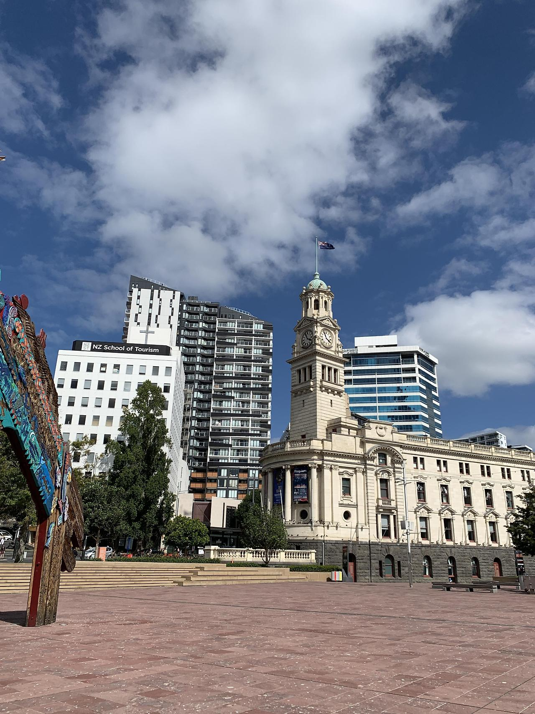
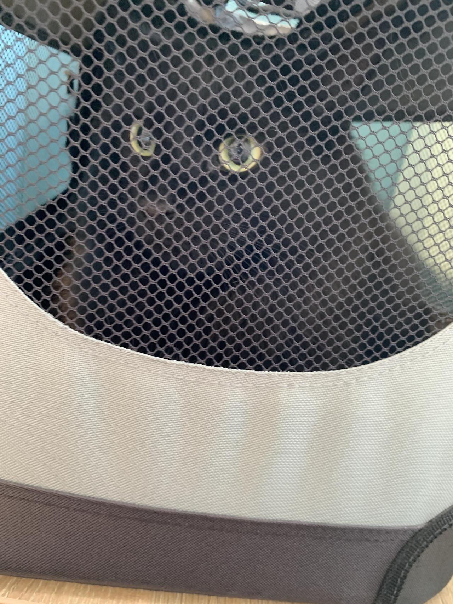
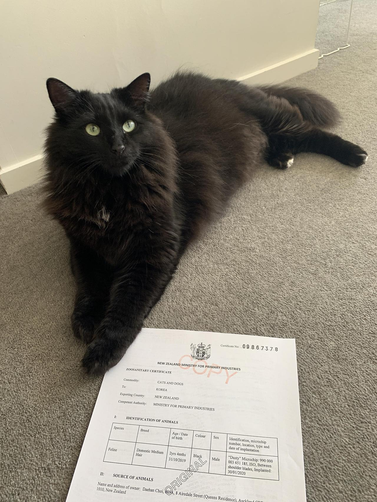
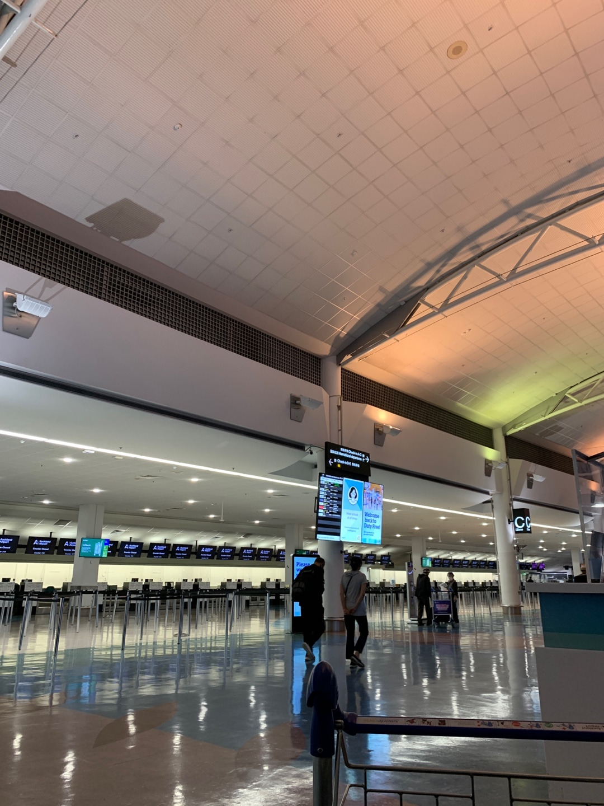
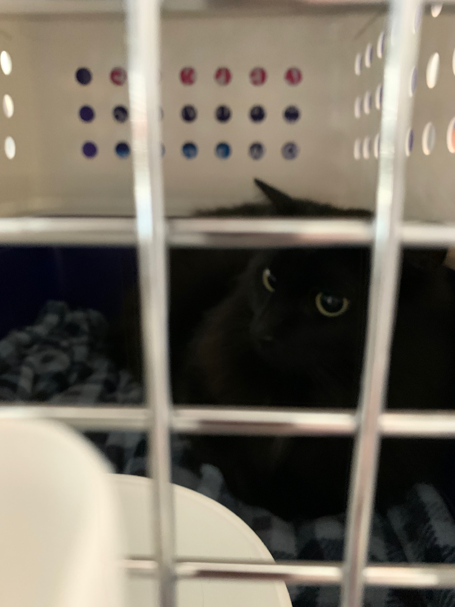
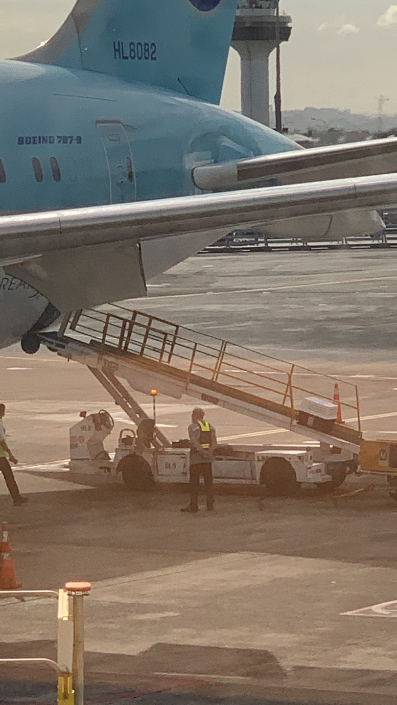
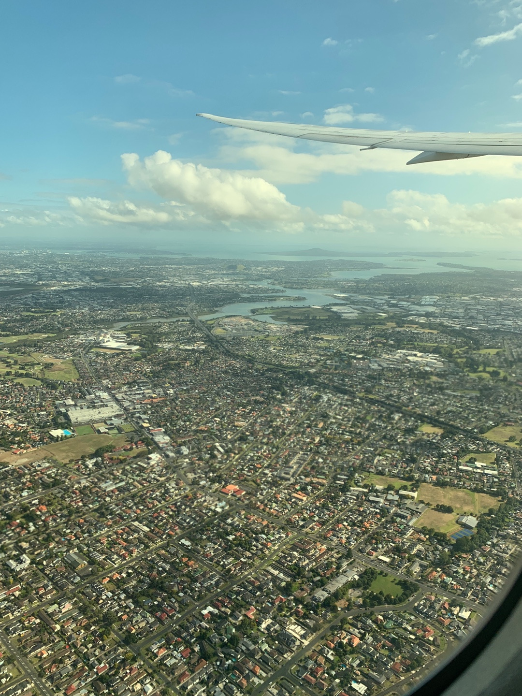
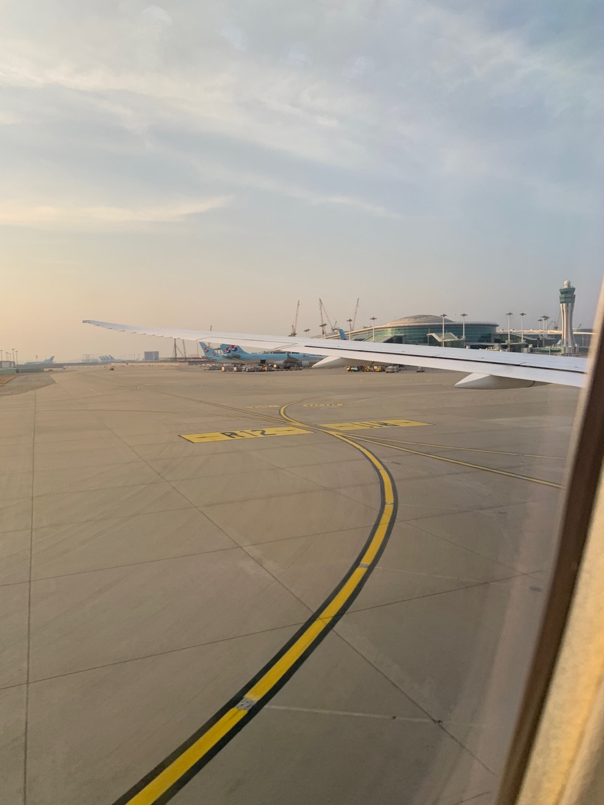
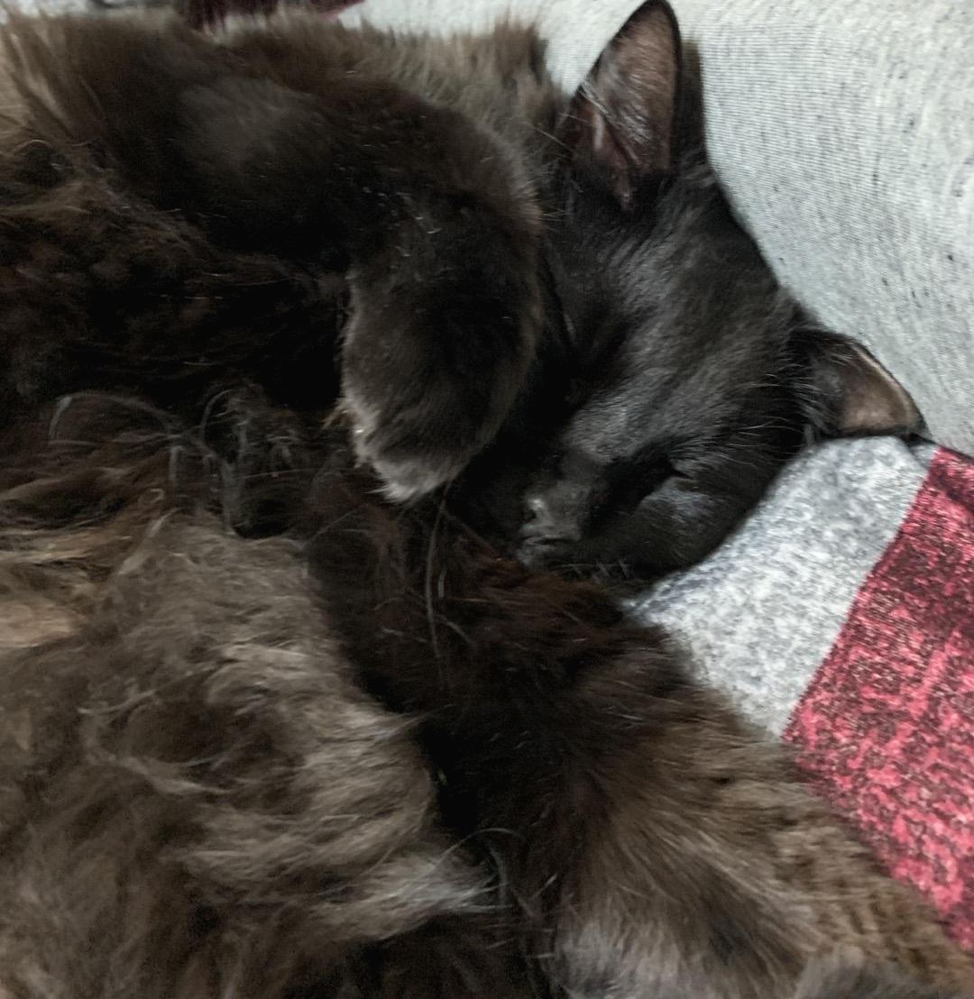

그렇게 퇴사를 하고 한국까지 2주간의 시간이 있었다. 

남들이 보면 너무 일찍 퇴사한 것 아니냐 할 수 있는데 나는 모든 준비를 2주 동안 여유롭게 하지만 꼼꼼하게 하면서 천천히 준비하고 싶었다. 

그리고 이번에 한국을 가게 되면 뉴질랜드에 다시 올 예정은 없으니 내가 당연하게 여겨왔던 현재 순간들을 기억하고 싶어서 여기저기 돌아다니고 사진도 많이 찍어두고 만날 사람들 만나고 하는 시간 또한 필요했다. 덕분에 엄청 많이 걷게 돼서 나름 좋은 운동이 되었다. 

<!-- more -->

{ width="480" height="640" style="display: block; margin: 0 auto" }

출국 1주 전부터는 본격적으로 바빠지기 시작했는데, 집 정리와 짐 정리를 하면서 동시에 먼지를 동물병원에 데려가 출국 전 건강검진을 했어야 했다. 

이런저런 서류도 준비할게 많았는데 시간을 여유롭게 두고 준비한 탓인지 크게 문제 되는 것은 없이 순조롭게 진행되었다. (특히 뉴질랜드는 Rabies-광견병 발생 국가가 아니어서 동물병원에서 따로 백신을 맞을 필요는 없었다.)  

Supporting Declaration Form이라는 걸 작성해서 동물병원에 가면 수의사가 vaccination pet records체크, 이런저런 간단한 검사 후 서명을 해 주는데 이걸 대행업체 쪽에 스캔본을 넘겨야 했다. 출국전 검역소에서 서류를 받을 때 꼭 필요한 준비 서류이기 때문에 혹시 몰라 복사본도 개인적으로 챙겼었다. 

{ width="480" height="640" style="display: block; margin: 0 auto" }

이때부터 새로운 케이지 훈련을 시키기 시작했다. 항공 캐리어를 대행업체 측에서 받았는데 사이즈도 커서 먼지 같은 덩치가 있는 고양이도 충분히 들어갈 수 있었다. 입구부터가 크니 혼자 알아서 잘 들어가더라. 전에 쓰던 캐리어는 새끼 때부터 쓰던 거라 너무 딱 맞는 사이즈였다. 

대망의 출국 하루 전 날에는 검역소인 Ministry for Primary Industries (MPI)에 가서 대행업체 직원을 만났다. 공항 바로 옆에 있어서 (30~40분 거리) 택시 타기엔 너무 비쌌기에 시간제 렌트카를 빌려서 갔다. 

거기서 간단히 설명을 듣고 검역소 직원이 먼지를 건물 안으로 데려가 이것저것 검사하는 동안 대행업체 직원이랑 40분 정도 얘기하면서 놀았다. 

검사가 끝나고 검역소 직원은 먼지와 2장의 승인된 출국 서류를 주었다. 별 문제는 없었고 다른 고양이들 처럼 겁먹은 것 밖에 없었음. 원본 서류는 한국 검역소에서 케이지 픽업할 때까지 반드시 지니고 있어야 한다. 혹시 몰라서 난 복사본도 준비해 놨었다. 

{ width="480" height="640" style="display: block; margin: 0 auto" }

대망의 출국날, 10시 비행기였지만 새벽 4시부터 일어나서 준비했다. 반려동물을 데려가는 거라 적어도 3시간 전에는 도착하려고 했다. 

같이 일했던 매니저가 아침에 공항까지 데려다줘서 편하게 올 수 있었다. 피곤했을 텐데 지금 생각해도 정말 고마웠다. 7시 맞춰서 도착은 잘했지만 막상 대한항공 카운터 자체는 8시부터 연다고 해서 한 시간 정도 앉아서 기다렸다.

{ width="480" height="640" style="display: block; margin: 0 auto" }

먼지는 캐리어 포함 무게가 10kg여서 화물칸으로 가야 했다. 항공권 예약 당시 반려동물 부가 서비스를 필수로 신청했었어야 해서 모든 정보는 도와주시는 담당자분께서 이미 가지고 계셔서 순조롭게 진행되었다. 

다만 오클랜드 공항 측과 살짝 어수선 한 부분이 있었는데 보통 다들 대행업체 껴서 진행하면 대행업체에서 항공기까지 알아서 실어서 보내는데 나는 대행업체에서 서류만 받고 개인적으로 먼지를 화물로 붙이는 케이스라 따로 케이지 내부 검사를 따로 했었어야 했다. 

당시 오클랜드 공항 직원들이 이런 경우는 처음이라 우왕좌왕 했었는데 괜히 나까지 불안해졌었다. 이건 항공사 by 항공사인 것 같다.

예로 제일 먼저 알아 보았던 Air New Zealand는 당시에 Covid-19로 인해 화물칸과 기내 모두 동물 반입 자체가 안되고 대행업체 측에서 따로 Cargo 항공편을 조율해야 한다 했었다..  나는 화물칸으로 가도 적어도 같은 비행기로 가고 싶었다. 

{ width="480" height="640" style="display: block; margin: 0 auto" }

먼지 캐리어 검사가 끝나고 공항 직원이 먼지를 사무실로 데려갔다. 어수선한 직후라 계속 걱정이 되었지만 대한항공 직원분께서 계속 follow up 해주신다 해서 마음을 좀 놓고 공항 구경을 했다. 코로나라 그런지 출국장 면세점도 많이 닫고 딱히 볼 건 없어서 음료수나 사 먹고 탈 때까지 기다렸다.

기다리면서 멍 때리는데 익숙한 상자가 올라가길래 얼른 찍었다. 저렇게 벨트 위로 올라가는데 웃기더라. 

{ width="480" height="640" style="display: block; margin: 0 auto" }

비행기가 이륙하고 나니 그제야 내가 한국을 이제 간다는 실감이 조금이나마 들기 시작했다. 웃기게도 이 포스팅을 하는 시점이 한국 온 지 한 달 넘었는데 아직도 한국에 왔다는 실감이 100% 나지 않는다. 

1년 정도 지나야 들 것 같다. 이제 다신 안 올 거 생각하니 괜히 창밖 풍경을 계속 보게 되었다. 그리고 기대하던 기내식이 나왔는데 첫끼는 스크램블 에그, 저녁은 닭고기에 콩 요리였는데 둘 다 별로였다. 코로나로 인함인지 메뉴도 고를 수 없어서 좀 아쉬웠다.

{ width="480" height="640" style="display: block; margin: 0 auto" }

그리고 먼지는 아무것도 못 먹고 계속 16시간 정도 갇혀 있어야 한다는 점 때문에 맘 편하게 먹거나 잘 수가 없었다. 

있어선 안될 일이지만 비행 중에 반려동물이 죽는다는 글도 몇 번 봤었던 터라 괜스레 스튜어디스 분에게 잘 좀 부탁한다고 말하곤 했는데 감사하게도 중간중간 계속 어떤 상황인지 알려주시더라. 

기장님이 온도랑 기압이랑 다 체크하면서 가니 걱정 말라고 해주셔서 그나마 맘 편하게 갈 수 있었다. 당시 비행기 외부 온도가 -68도라 그래도 계속 신경 쓰이긴 했다.

{ width="480" height="640" style="display: block; margin: 0 auto" }
12시간 비행끝에 드디어 한국 땅을 밟았다. 익숙하면서 어색한 공항 냄새, 3월의 찬 공기 등, 한국어 간판 등을 보며 드디어 왔구나 싶었다. 바로 먼지를 확인하러 가고 싶었는데 코로나로 인해 방역 관련한 조사를 먼저 해야 했다. 출국 48시간 전 검사했던 PCR 음성 결과지를 건네고 어디로 갈 건지, 전화번호 확인 등을 한 후에 내보내 주었는데 나는 미리미리 검색해서 준비해 놨어서 생각보다 오래 걸리진 않았다. 근데 무슨 어플도 미리 깔아 놨었는데 이제 안쓴다 하더라 ㅋ

먼지는 짐 찾는공간 옆에 인포메이션 데스크 쪽에 있었는데 담당자분께서 기다리고 있었다. 먼지를 바로 확인했었는데 캐리어 윗부분 손잡이가 휘어있고 접합하는 볼트 쪽이 빠져있어서 직원이 실수로 캐리어를 떨어뜨린 건지, 아니면 짐칸에서 짐들이 밀리면서 휜 건지 알 수가 없었다. 물그릇도 엎어져있고 먼지도 담요에 소변을 봤었어서 그런 거 따지기보다는 얼른 집 데려가는 게 날 것 같아서 마지막으로 직원분과 입국장 검역소 에서 검사를 한 뒤에 바로 출국장을 나왔다.

엄마와 동생이 데리러 와서 차 타고 집에 가는데 이동장에서 나는 먼지의 진한 소변 냄새 때문에 창문을 열고 환기시키면서 갔다. 집에 데려왔는데 처음에는 무서워했지만 걱정이 무색할 정도로(...) 하루 만에 적응해서 벌러덩 하길래 나도 금방 마음을 놓을 수 있었다. 이 정도로 적응을 잘할 줄이야.. 그래도 무사히 건강하게 데리고 올 수 있어서 다행이었다

이렇게 나름 길었던 뉴질랜드와의 인연을 끝내고 한국에서의 새 시작을 하게 되었다. 한국 도착하면 블로그에 글 써야지 계속 말만 하면서 계속 미뤄 왔었는데 한 달이 지난 이제야 포스팅을 하게 됐다. 성취감이 느껴지는 순간이다. 매번 미뤄만 왔었는데 드디어 이렇게 뭔가 진득하게 하나 끝냈다는 점이 좋은 변화가 아닐까 생각한다. 

친구 曰: "_너 이제 그럼 인생 2막 시작이네?"라는_ 말이 괜스레 기분 좋게 들렸다.

새로운 출발과 변화가 있을 것이다. 당장만 해도 나는 호텔 직종에서 웹 개발 쪽으로 전향을 했다. 여태까지 걸어가던 길을 확 틀어서 간다는 게 쉬운 결정은 아니었지만 좋은 타이밍에 좋은 변화가 아닐까 생각해본다. 이번에 코드 스테이츠라는 부트캠프의 백엔드 과정에 합격도 되었다. 당장 25일부터 과정이 시작되는데 매우 바빠질 예정이지만 그럼에도 너무 행복하다 :)

{ width="480" height="640" style="display: block; margin: 0 auto" }